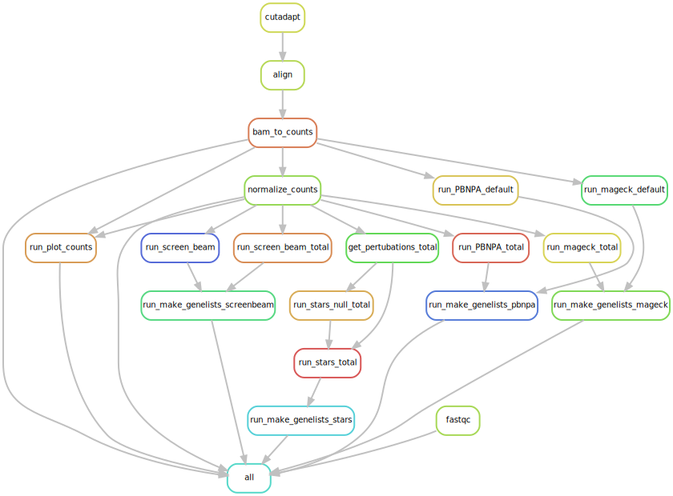

# CRISPRkat

Pipeline to analyze genome wide CRISPR screens. 

## Prerequisites 

Install the following:

* cutadapt
* Bowtie2
* MaGECK
* STARS (downloaded [here](https://portals.broadinstitute.org/gpp/public/software/stars) and adapted to fit into pipeline) 
* ScreenBEAM

Prepare config.yml

* Fill out config_example.yml to match your experiment.
* Build bowtie2 library `bowtie2-build lib.fa bowtie2_lib` 
* E.g.: `awk -F ',' '{print ">"$1"\n"$2}' Human_GeCKOv2_Library_combine.csv > Human_GeCKOv2_Library_combine.fa; bowtie2-build Human_GeCKOv2_Library_combine.fa bowtie2_Human_GeCKOv2_Library_combine`
* `cut -f 3 -d "," Human_GeCKOv2_Library_combine.csv | grep NonTar > Human_GeCKOv2_Library_combine_control_genes.txt`
* `grep NonTar Human_GeCKOv2_Library_combine.csv | cut -f 1 -d"," > Human_GeCKOv2_Library_combine_control_sgRNA.txt`

### For STARS

Make this header file:

	[hayer]$ cat header
	Barcode Sequence	Annotated Gene Symbol

Then:

	cut -f 1,3 -d',' --output-delimiter=$'\t' Human_GeCKOv2_Library_combine.csv > tmp
	cat header tmp > STARS_Human_GeCKOv2_Library_combine.txt
	rm tmp

## File Formats

Please see example_files folder.

## Test Run

Dryrun:

snakemake --configfile config_example.yaml --dryrun -d test_dir/  -p

Make dag:

	snakemake --dag --configfile config_example.yaml -d test_dir | dot -Tsvg > dag.svg
	rsvg-convert dag.svg > workflow.png

## Make this rulegraph

    ssnakemake --configfile config_example.yaml -d test_dir --use-conda --rulegraph  | dot -Tsvg > dag.svg

## Run pipeline with snakemake file

Use with screen:

	source activate snakemake_env
	snakemake -s ~/data/tools/CRISPRkat/Snakefile --configfile ~/data/tools/CRISPRkat/config_A3A.yaml -d .  -c "qsub -l h_vmem={params.mem} -l mem_free={params.mem} -pe smp {threads} -j y -V -cwd" -j -p --restart-times 3 --max-jobs-per-second 10 --latency-wait 100

